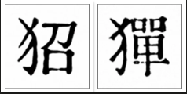
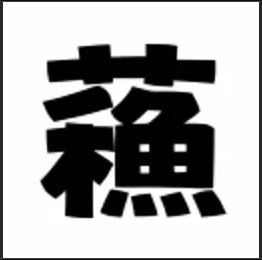
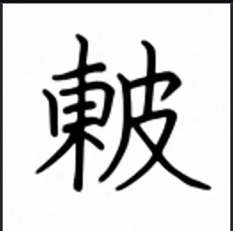

# Create Your Own Chinese Characters that Never Existed Before
Be creative and combine radicals in arbitrary ways. Have fun and confuse OCR.

- Pre-generated cache
  - https://lqu.github.io/ming-kwai
- Dynamic generation
  - https://huggingface.co/spaces/lqume/neochar

## Examples

明快中文英文打字機

Since 峯==峰 , 崖==崕, 羣==群, 美,加,墨 can have new forms, too.

On seeing , people might think of 貂蟬, but the chars don't exist.

If you don't want OCR to see 蘇東坡, use this.
 
