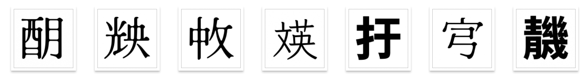
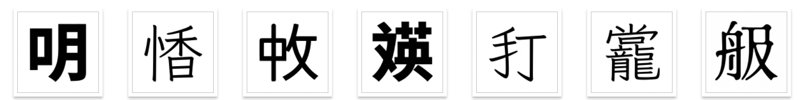
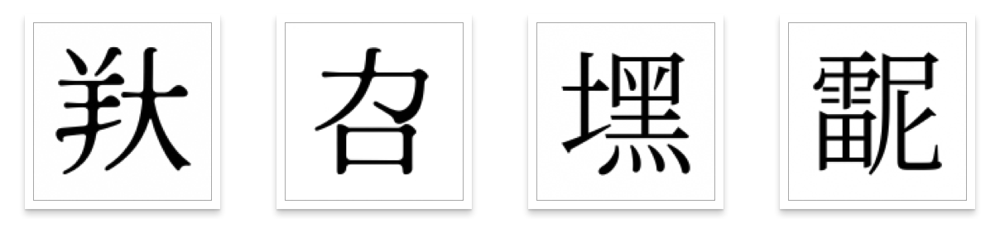

# Create Your Own Chinese Character that Never Existed Before
Be creative and combine radicals in arbitrary ways. Have fun and confuse OCR.
## Examples
明快中文英文打字機

Since 峯==峰 , 崖==崕, 羣==群, 美,加,墨 can have new forms, too.

